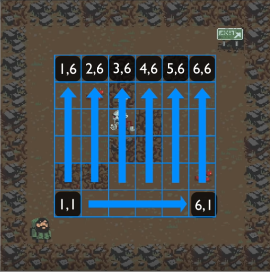

## TUTO :

Complete tuto is here :
https://learn.unity.com/project/2d-roguelike-tutorial?language=en&courseId=5c87c0a2edbc2a001fbc38ed

***
GameManager schema :

***
Game :
https://cen-paris8.github.io/unity-2DRoguelike/gh-pages/

***
To Play :  

Player One :  
	* Up : Up  
	* Down : Down  
	* Turn Right : Right  
	* Turn Left : Left  
	  
	
***

Notions abordées:
* Les génériques : List<>
* Objets sérialisés
* Set Up d'une scène avec des éléments random.
* Les Coroutines et les déplacement smoothy
* Les classes virtuelles et leur dérivées.
* Keyword base 
* Epsilon : la plus petite valeur >0
* Modification des sprites par script
* Les animators SetTrigger
* Axe d'amélioration remplacer les envois de messag dans les fonctions loadScene par des delegates.

